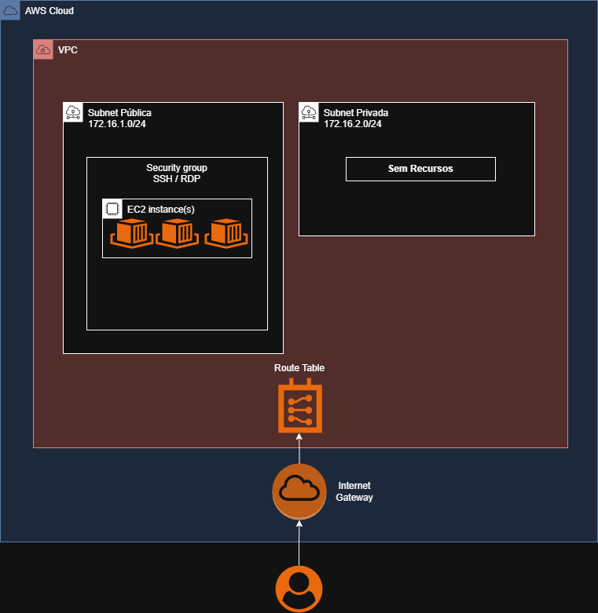

# Terraform EC2 Provisioner

Essa solução tem como objetivo permitir o provisionamento automatizado de instâncias EC2 na AWS, incluindo toda a infraestrutura necessária, como VPC, Subnets, Internet Gateway, NAT Gateway, Route Tables e Security Groups, utilizando módulos reutilizáveis por ambiente (DEV e PROD).

Dessa forma, é possível, através de um único projeto, realizar o deploy de uma infraestrutura completa, padronizada e escalável para diferentes ambientes. Além disso, a esteira de CI/CD pode ser integrada aos seus projetos, permitindo automatizar a construção e o provisionamento da infraestrutura necessária para suas aplicações de forma prática, segura e consistente.


---

## Estrutura

```
TerraformEC2Provisioner/
├── environments/
|   ├── prod/            → Módulo raiz do PROD
|   └── dev/             → Módulo raiz do DEV
├── modules/
│   ├── vpc/             → VPC, subnets pública/privada, IGW, route table
│   ├── security_group/  → Security group com regras de acesso SSH/RDP
│   └── ec2/             → Instâncias EC2 com disco criptografado

```

Os módulos em `modules/` são reutilizáveis e não rodam sozinhos — o Terraform é sempre executado dentro de `environments/prod` ou `environments/dev`.

---

## Como usar este projeto

### 1. Clone o repositório e crie as branches

```bash
git clone git@github.com:brunomdmd/TerraformEC2Provisioner.git

cd TerraformEC2Provisioner

git checkout -b development   # Para fazer deploy no ambiente de DEV

git checkout -b production # Para fazer deploy no ambiente de PROD
```

> Essas branches são obrigatórias — o pipeline CI/CD usa o nome da branch para saber qual ambiente provisionar. Um push para `development` executa o módulo `environments/dev`, um push para `production` executa o módulo `environments/prod`.

---

### 2. Pré-requisitos

- Instalei o [AWS CLI](https://aws.amazon.com/pt/cli/)

Para preparar a AWS para utilização dessa solução, é necessário criar um usuário IAM na AWS com as seguintes permissões, seguindo o princípio do menor privilégio (least privilege access):

```json
{
	"Version": "2012-10-17",
	"Statement": [
		{
			"Sid": "VisualEditor0",
			"Effect": "Allow",
			"Action": [
				"ec2:DeleteSubnet",
				"ec2:AuthorizeSecurityGroupIngress",
				"ec2:DescribeInstances",
				"ec2:CreateKeyPair",
				"ec2:AttachInternetGateway",
				"ec2:DeleteRouteTable",
				"ec2:AssociateRouteTable",
				"ec2:DescribeInternetGateways",
				"ec2:StartInstances",
				"ec2:CreateRoute",
				"ec2:CreateInternetGateway",
				"ec2:RevokeSecurityGroupEgress",
				"ec2:DescribeVolumes",
				"ec2:DescribeAccountAttributes",
				"ec2:DeleteInternetGateway",
				"ec2:DescribeKeyPairs",
				"ec2:DescribeRouteTables",
				"ec2:CreateTags",
				"ec2:CreateRouteTable",
				"ec2:RunInstances",
				"ec2:DetachInternetGateway",
				"ec2:DisassociateRouteTable",
				"ec2:StopInstances",
				"ec2:DescribeInstanceCreditSpecifications",
				"ec2:RevokeSecurityGroupIngress",
				"ec2:GetPasswordData",
				"ec2:DescribeSecurityGroupRules",
				"ec2:DescribeInstanceTypes",
				"ec2:DeleteVpc",
				"ec2:CreateSubnet",
				"ec2:DescribeSubnets",
				"ec2:DeleteTags",
				"ec2:DescribeInstanceAttribute",
				"ec2:CreateVpc",
				"ec2:DescribeVpcAttribute",
				"ec2:ModifySubnetAttribute",
				"ec2:DescribeNetworkInterfaces",
				"ec2:DescribeAvailabilityZones",
				"ec2:CreateSecurityGroup",
				"ec2:ModifyVpcAttribute",
				"ec2:ModifyInstanceAttribute",
				"ec2:AuthorizeSecurityGroupEgress",
				"ec2:TerminateInstances",
				"ec2:DescribeTags",
				"ec2:DeleteRoute",
				"ec2:DescribeSecurityGroups",
				"ec2:DescribeImages",
				"ec2:DescribeVpcs",
				"ec2:DeleteSecurityGroup",
				"ec2:MonitorInstances",
				"ec2:AllocateAddress",
				"ec2:DescribeAddresses",
				"ec2:DescribeAddressesAttribute",
				"ec2:ReleaseAddress",
				"ec2:CreateNatGateway",
				"ec2:DescribeNatGateways",
				"ec2:DeleteNatGateway",
				"ec2:DisassociateAddress"
			],
			"Resource": "*"
		},
		{
			"Sid": "VisualEditor1",
			"Effect": "Allow",
			"Action": [
				"s3:PutObject",
				"s3:GetObject",
				"s3:CreateBucket",
				"s3:ListBucket",
				"s3:DeleteObject",
				"s3:PutBucketVersioning"
			],
			"Resource": [
				"arn:aws:s3:::*-tfstate*",
				"arn:aws:s3:::*-tfstate*/*"
			]
		}
	]
}
```

Agora, crie uma **Access Key** e selecione o caso de uso “Command Line Interface (CLI)”.

Em seguida, copie os valores de **Access Key ID** e **Secret Access Key** e armazene-os em um local seguro, pois essas credenciais serão utilizadas posteriormente na criação dos Secrets do GitHub, permitindo a autenticação da pipeline CI/CD com a AWS. Além disso, você também deverá utilizar essas credenciais para configurar o acesso local à AWS através da AWS CLI e realizar a criação de recursos diretamente pelo terminal, executando o comando abaixo:

```bash
aws configure
```

Após executar o comando, informe:

```bash
AWS Access Key ID: [Access Key Copiada]
AWS Secret Access Key: [Secret Access Copiada]
Default region name: [us-east-1]
Default output format: [None]
```

Com isso, seu ambiente local estará autenticado e apto para realizar operações na AWS via linha de comando.


#### Bucket S3 — state remoto

O "Terraform EC2 Provisioner" salva o [state file](https://developer.hashicorp.com/terraform/language/state) em um bucket S3. 

> **Importante:** O nome do bucket deve conter `-tfstate`, conforme a restrição configurada nas permissões do usuário IAM.


```bash
aws s3api create-bucket --bucket SEU_BUCKET-tfstate --region us-east-1
aws s3api put-bucket-versioning \
  --bucket SEU_BUCKET-tfstate \
  --versioning-configuration Status=Enabled
```


#### Key Pair — acesso SSH e descriptografia de senha Windows

```bash
aws ec2 create-key-pair \
  --key-name NOME_DA_CHAVE \
  --query "KeyMaterial" \
  --output text > NOME_DA_CHAVE.pem

chmod 400 NOME_DA_CHAVE.pem
```
---


### 3. GitHub Actions — Secrets obrigatórios

O pipeline usa três secrets que devem ser configurados no repositório em **Settings → Secrets and variables → Actions**:

| Secret | Descrição |
|---|---|
| `AWS_ACCESS_KEY_ID` | Access Key do usuário IAM criado no passo 2 |
| `AWS_SECRET_ACCESS_KEY` | Secret Key do mesmo usuário criado no passo 2 |
| `MY_IP_CIDR` | Seu IP público em CIDR (ex: `1.2.3.4/32`) |

---

### 4. Deploy via GitHub Actions (fluxo principal)

Faço o checkout para a branch que deseja subir o ambiente

```bash
# Sobe recursos no ambiente DEV
git checkout development

# Sobe recursos no ambiente PROD
git checkout production
```

---


### 5. Definição das varíaveis e nome do bucket s3 no backend

As variáveis ficam nos arquivos `environments/dev/variables.tf` e `environments/prod/variables.tf`. 

| Variável | Descrição |
|---|---|
| `service` | Nome do serviço/projeto, usado nas tags dos recursos |
| `myip` | Seu IP público em CIDR (ex: `1.2.3.4/32`) — libera acesso SSH/RDP apenas para você. Obtenha com `curl https://checkip.amazonaws.com` |
| `os_type` | Sistema operacional das instâncias: `AMAZON_LINUX_2023`, `UBUNTU_22_04`, `UBUNTU_24_04`, `WINDOWS_2019` ou `WINDOWS_2022` |
| `private_instance_count` | Quantidade de instâncias EC2 na subnet privada (default: `1`) |
| `public_instance_count` | Quantidade de instâncias EC2 na subnet pública (default: `0`) |
| `instance_type` | Tipo da instância EC2 (ex: `t3.micro`). Deve ser arquitetura x86_64 |
| `key_name` | Nome do Key Pair criado na etapa anterior |

#### Dinâmica de subnets

Ambos os ambientes (DEV e PROD) possuem dois módulos EC2 independentes — `ec2_private` e `ec2_public` — cada um fixo na sua respectiva subnet. Isso significa que é possível ter instâncias nas duas subnets simultaneamente, sem que uma interfira na outra.

O controle é feito pelas variáveis `private_instance_count` e `public_instance_count`. Definir qualquer uma delas como `0` simplesmente não sobe instâncias naquela subnet — sem destruir as da outra.


> Por padrão, `public_instance_count = 0` — nenhuma instância sobe na subnet pública a não ser que seja solicitado explicitamente.


Depois configure o nome do bucket no backend para o ambiente que deseja subir:

| Arquivo | Linha a alterar |
|---|---|
| `environments/prod/main.tf` | `bucket = "SEU_BUCKET-tfstate_PROD"` |
| `environments/dev/main.tf`  | `bucket = "SEU_BUCKET-tfstate_DEV"` |


```bash
# Prepare  as modificações próximo salvamento (commit).
git add -A

# Faça o commit das alterações
git commit -m 'Defina uma descrição rápida'

# Sobe recursos no ambiente DEV ou PROD
git push origin development [OU] production
```

O pipeline executa automaticamente:

1. **Checkov** — análise de segurança estática no código Terraform (detalhes abaixo)
2. **Terraform Init** — inicializa o backend e baixa os providers
3. **Terraform Apply** — provisiona a infraestrutura do ambiente correspondente

Para **destruir** os recursos, acesse **Actions → Terraform Destroy** no GitHub, selecione a branch (development ou production) o ambiente desejado (DEV ou PROD). O destroy é **manual** e **intencional** — não acontece por push.

---

## Checkov — Análise de segurança estática

O [Checkov](https://www.checkov.io/) é uma ferramenta open source de análise estática para infraestrutura como código. Ele verifica o código Terraform antes de qualquer apply, identificando configurações que violam boas práticas de segurança.

**O que ele faz neste projeto:**

- Analisa todos os arquivos `.tf` em busca de vulnerabilidades e configurações incorretas
- Foca apenas em severidades **HIGH** e **CRITICAL** (ruídos de LOW/MEDIUM são ignorados)
- Roda como primeiro job do pipeline — se encontrar violações, o `terraform apply` não é executado

**Por que isso importa:**

Mesmo em ambientes de estudo, rodar o Checkov ajuda a desenvolver o hábito de escrever infraestrutura segura desde o início. Em ambientes empresariais, ele atua como gate obrigatório antes do deploy.

---

## Uso local (opcional)

Se preferir rodar o Terraform diretamente na sua máquina sem depender do CI/CD:

- Instale o [Terraform](https://developer.hashicorp.com/terraform/tutorials/aws-get-started/install-cli) >= 1.4.0
- Instalei o [AWS CLI](https://aws.amazon.com/pt/cli/) e execute `aws configure` para definir as credenciais

```bash
# Entre na pasta do ambiente desejado
cd environments/dev   # ou environments/prod

# Primeira vez (baixa providers e configura backend)
terraform init

# Visualiza o que será criado/alterado
terraform plan

# Aplica as mudanças
terraform apply

# Destrói toda a infraestrutura do ambiente
terraform destroy
```

---

## Acesso às instâncias

### Linux — SSH

#### Instância pública (acesso direto)

```bash
# Conecte diretamente
ssh -i NOME_DA_CHAVE.pem ec2-user@IP_PUBLICO
```

#### Instância privada (via bastion na subnet pública)

As instâncias privadas não têm IP público. O acesso é feito usando a instância pública como bastion com **SSH Agent Forwarding** — a chave nunca precisa sair da sua máquina.

```bash
# 1. Inicie o agente SSH (se ainda não estiver rodando)
eval $(ssh-agent -s)

# 2. Adicione sua chave ao agente
ssh-add NOME_DA_CHAVE.pem

# 3. Conecte no bastion com -A (agent forwarding)
ssh -A -i NOME_DA_CHAVE.pem ec2-user@IP_PUBLICO_BASTION

# 4. De dentro do bastion, conecte na instância privada (sem especificar chave)
ssh ec2-user@IP_PRIVADO
```


### Windows — RDP

#### Instância pública (acesso direto)
> A senha só fica disponível por volta de 5 minutos após a criação da instância EC2. Se retornar vazio, aguarde e tente novamente.

> Se receber `Unable to decrypt password data using provided private key file`, sua chave pode estar no formato OpenSSH. Converta antes:
> ```bash
> cp NOME_DA_CHAVE.pem NOME_DA_CHAVE.pem.bak
> ssh-keygen -p -m PEM -f NOME_DA_CHAVE.pem
> ```

```bash
# Descriptografe a senha de Administrator
aws ec2 get-password-data \
  --instance-id i-XXXXXXXXXXXXXXXXX \
  --priv-launch-key NOME_DA_CHAVE.pem \
  --query "PasswordData" \
  --output text
```

Conecte via RDP com:
- **Host:** IP público da instância
- **Usuário:** `Administrator`
- **Senha:** valor retornado acima

#### Instância privada (via bastion na subnet pública)

As instâncias privadas não têm IP público. Acesse primeiro a instância pública via RDP e, de dentro dela, abra uma nova conexão RDP apontando para o IP privado da instância destino.


---

## Módulos

### `modules/vpc`

Cria a rede base do ambiente.

| Recurso | Nome na AWS |
|---|---|
| VPC | `VPC-{ambiente}` |
| Subnet pública | `SUBNET_PUBL-{ambiente}` |
| Subnet privada | `SUBNET_PRIV-{ambiente}` |
| Route table pública | `RT-PUBLIC-{ambiente}` |
| Route table privada | `RT-PRIVATE-{ambiente}` |
| Internet Gateway | `IGW-{ambiente}` |
| NAT Gateway | `NGW-{ambiente}` |

**Outputs:** `vpc_id`, `subnet_public_id`, `subnet_private_id`, `aws_vpc_cidr_block`

### `modules/security_group`

Cria um security group com acesso SSH/RDP liberado para o CIDR da VPC e para o seu IP (`myip`).

| Recurso | Nome na AWS |
|---|---|
| Security Group | `SG-DEFAULT-{ambiente}` |

**Outputs:** `security_group_id`

### `modules/ec2`

Cria `N` instâncias EC2 com disco criptografado. Usado pelos módulos `ec2_private` e `ec2_public` de cada ambiente.

- Nome das instâncias: `{ambiente}-{OS_TYPE}-{PRIVATE|PUBLIC}-01`, ex: `PROD-AMAZON_LINUX_2023-PRIVATE-01`
- AMI buscada automaticamente via data source com base no `os_type`

**Outputs:** `public_ip[]`, `private_ip[]`, `instance_ids[]`, `instance_name[]`

---

## Arquitetura Final V1
Com a versão V1 desse projeto, essa será a arquitetura da infraestrutura provisionada:



